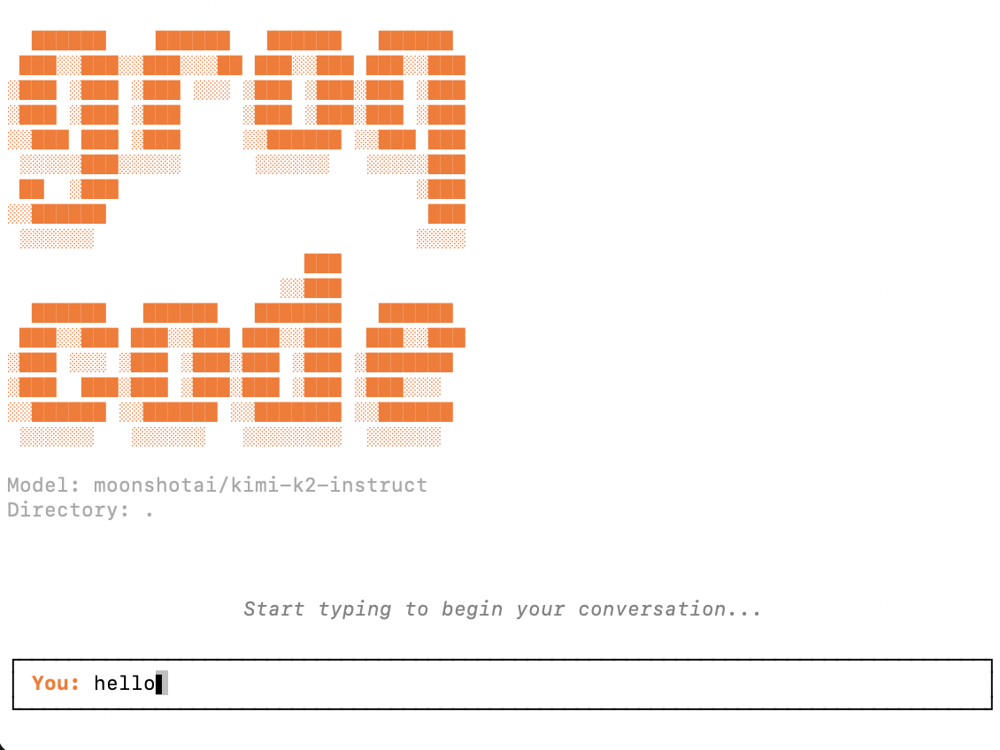
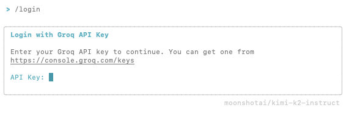

<h2 align="center">
 <br>
 
 <br>
 <br>
 Groq Code CLI: A highly customizable, lightweight, and open-source coding CLI powered by Groq for instant iteration.
 <br>
</h2>

<p align="center">
 <a href="https://github.com/build-with-groq/groq-code-cli/stargazers"></a>
 <a href="https://github.com/build-with-groq/groq-code-cli/blob/main/LICENSE">
 
 </a>
</p>

<p align="center">
 <a href="#Overview">Overview</a> •
 <a href="#Installation">Installation</a> •
 <a href="#Usage">Usage</a> •
 <a href="#Development">Development</a>
</p>

<br>

Coming soon: [Demo of Groq Code CLI]()
> Demo of Groq Code CLI

<br>

# Overview

...


## Installation

### For Developing

```bash
git clone https://github.com/build-with-groq/groq-code-cli.git
cd groq-code-cli
npm install
npm run build
npm link        # Enables the `groq` command in any directory
```

```bash
# Run this in the background during development to automatically apply any changes to the source code
npm run dev  
```

## Usage
```bash
# Start chat session
groq
```

### Command Line Options

```bash
groq [prompt] [options]

Options:
  -t, --temperature <temp>      Temperature for generation (default: 1)
  -s, --system <message>        Custom system message
  -h, --help                    Display help for command
  -V, --version                 Display version number
```

### Authentication

On first use, start a chat:

```bash
groq
```

And type the `/login` command:


>Get your API key from the <strong>Groq Console</strong> [here](https://console.groq.com/keys)

This creates a .groq/ folder in your home directory that stores your API key, default model selection, and any other config you wish to add.

You can also set your API key for your current directory via environment variable:
```bash
export GROQ_API_KEY=your_api_key_here
```

### Available Commands
- `/help` - Show available commands


## Development

### Project Structure

...

### Available Scripts

```bash
npm run build      # Build TypeScript to dist/
npm run dev        # Build in watch mode
```

### Testing Locally

```bash
npm run build
npm link
npm run dev
```


## Contributing and Support

Improvements through PRs are welcome!

For issues and feature requests, please open an issue on GitHub.

#### Share what you create with Groq on our [socials](https://x.com/GroqInc)!
